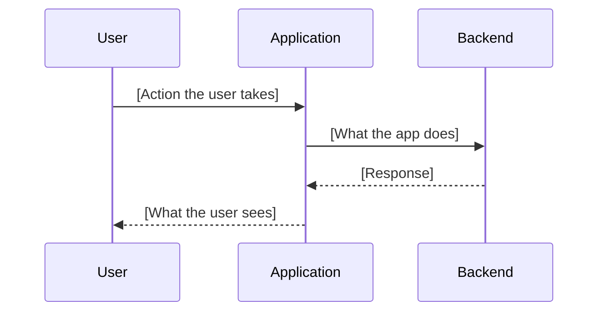
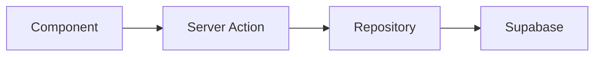

# Linear Ticket Creation Skill

## When This Skill Activates

This skill automatically activates when you:
- Create a Linear issue or ticket
- Are asked to plan work, break down a feature, or file a bug
- Use `/ticket` or are asked to "create an issue"
- Break a large task into sub-tickets

## Core Principle

**A ticket is a contract.** The person implementing it (human or AI) should be able to understand the full context — who's affected, what the user experiences, what the architecture looks like, and when it's done — without asking follow-up questions.

## Ticket Description Template

Every ticket description MUST use this structure, adapting sections based on complexity:

````markdown
## User Story

As a **[persona]**, I want to **[action]** so that **[outcome]**.

> Example: As a **sales manager**, I want to **see which reps haven't logged calls this week** so that **I can follow up before pipeline reviews**.

## Context

<2-3 sentences: Why does this matter now? What triggered this work? Link to related tickets, customer feedback, or incidents.>

## Current Behavior

<What happens today? For bugs: exact repro steps. For features: what the user currently does (often a workaround).>

## Expected Behavior

<What should happen after this ticket is done? Be specific — "it should work" is not acceptable.>

## User Journey

<Step-by-step flow showing how the user interacts with this change.>



## Architecture

<Which layers/components are involved? Include a diagram for any multi-component change.>



**Key files:**
| File | Role |
|------|------|
| `path/to/file.ts` | Description of what this file does |

## Edge Cases

- [ ] <Boundary condition 1 — e.g., "What if the user has no calls this week?">
- [ ] <Boundary condition 2 — e.g., "What if the org has 100+ reps?">
- [ ] <Error state — e.g., "What if Nylas API is down?">
- [ ] <Concurrency — e.g., "What if two users edit simultaneously?">

## Acceptance Criteria

- [ ] <Concrete, testable criterion 1>
- [ ] <Concrete, testable criterion 2>
- [ ] <Concrete, testable criterion 3>
- [ ] Unit tests cover core logic
- [ ] `bun run ci` passes

## Testing Plan

### Automated
- Unit tests for: <list specific functions/actions>
- Integration tests for: <if applicable>

### Manual
- [ ] <Step-by-step manual test 1>
- [ ] <Step-by-step manual test 2>

## Dependencies

- Blocked by: <[PROJ]-XXXXXX if applicable>
- Blocks: <[PROJ]-XXXXXX if applicable>
- External: <Any external service dependency>
````

## Section Usage by Ticket Type

Not every ticket needs every section. Use this guide:

| Section | Feature | Bug | Improvement | Chore |
|---------|:---:|:---:|:---:|:---:|
| User Story | **Required** | **Required** | **Required** | Optional |
| Context | **Required** | **Required** | **Required** | Brief |
| Current Behavior | **Required** | **Required** (repro steps) | **Required** | Skip |
| Expected Behavior | **Required** | **Required** | **Required** | Skip |
| User Journey | **Required** | If UI-related | If UI-related | Skip |
| Architecture | If multi-component | If non-obvious | If refactor | Skip |
| Edge Cases | **Required** | **Required** | **Required** | Skip |
| Acceptance Criteria | **Required** | **Required** | **Required** | **Required** |
| Testing Plan | **Required** | **Required** | **Required** | Optional |
| Dependencies | If applicable | If applicable | If applicable | If applicable |

## Creating the Issue

### Step 1: Research the Codebase

Before writing the ticket, understand what exists:

```bash
# Find relevant files
# Read existing implementations
# Understand current architecture
```

This context goes directly into the Architecture section and Key Files table.

### Step 2: Write the Description

Follow the template above. Key quality checks:
- **User Story** names a real persona (solo coach, team admin, agency manager), not "a user"
- **Edge Cases** has at least 3 items for features, 2 for bugs
- **Acceptance Criteria** are testable — each one could be a unit test assertion
- **Architecture** includes file paths, not vague component names

### Step 3: Create in Linear

```
Tool: mcp__linear-server__create_issue
  title: "type(scope): concise description"
  team: "[YOUR_TEAM]"
  description: <full markdown from template>
  labels: ["Feature"] or ["Bug"] or ["Improvement"]
  priority: 2 (High), 3 (Normal), or 4 (Low)
```

### Step 4: Set Relationships

If the ticket blocks or is blocked by other work:

```
Tool: mcp__linear-server__update_issue
  id: "[PROJ]-XXXXXX"
  blocks: ["[PROJ]-XXXYYY"]
  blockedBy: ["[PROJ]-XXXZZZ"]
```

## Title Format

Use conventional commit style for consistency with PRs and commits:

```
feat(scheduler): add buffer time configuration
fix(billing): prevent duplicate charge on plan switch
refactor(webhooks): extract Nylas handler registry
perf(dashboard): lazy-load analytics charts
chore(deps): upgrade Stripe SDK to v20
```

Keep titles under 70 characters. Use the description for details.

## Labels

Always apply exactly one primary label:
- **Feature** — new functionality
- **Bug** — broken existing functionality
- **Improvement** — enhancement to existing functionality

## Priority Guide

| Priority | When to Use |
|----------|-------------|
| 1 - Urgent | Production is broken, revenue impact |
| 2 - High | Blocks other work, customer-facing regression |
| 3 - Normal | Standard feature/improvement work |
| 4 - Low | Nice-to-have, tech debt, minor polish |

## Breaking Down Large Tickets

If a ticket is too large (estimated >2 days), break it into sub-tickets:

1. Create a parent ticket with the full vision (all sections)
2. Create child tickets, each independently shippable
3. Each child references the parent: "Part of [PROJ]-XXXXXX"
4. Each child has its own acceptance criteria

```
[PROJ]-XXX: feat(analytics): revenue dashboard (parent — full context)
  ├── [PROJ]-XXX: feat(analytics): revenue summary cards
  ├── [PROJ]-XXX: feat(analytics): revenue trend chart
  └── [PROJ]-XXX: feat(analytics): revenue by rep breakdown
```

## Anti-Patterns

```markdown
# Thin ticket — no context for implementer
Title: "Fix the dashboard"
Description: "Dashboard is broken, please fix"

# Missing edge cases — bugs will ship
Title: "Add CSV export"
Description: "Users should be able to export data as CSV"
(No mention of: empty data, large datasets, special characters, encoding)

# Vague acceptance criteria — how do you know when it's done?
Acceptance: "It should work correctly"

# Missing architecture — implementer has to rediscover everything
Title: "Add booking notifications"
Description: "Send a notification when a booking is created"
(No mention of: which service sends it, what template, what data, error handling)
```

## Bidirectional Linking: Ticket ↔ PR

When a ticket is created:
- The branch name will contain the issue ID: `feat/[PROJ]-XXXXXX-description`
- Linear's GitHub integration auto-links PRs that reference `[PROJ]-XXXXXX`
- The PR description includes a `## Linear` section with `Fixes: [PROJ]-XXXXXX`
- On merge, Linear can auto-close the issue

This creates full traceability: Ticket → Branch → PR → Merge → Auto-close.

## Quick Reference

| Step | Action | Required? |
|------|--------|-----------|
| Research codebase | Read relevant files, understand architecture | **YES** |
| Write user story | Real persona, specific action, clear outcome | **YES** |
| Document current state | What happens today (repro steps for bugs) | **YES** |
| Define expected state | What should happen after implementation | **YES** |
| Map user journey | Mermaid sequence diagram for UI changes | For features/UI bugs |
| Draw architecture | Component diagram with file paths | For multi-component work |
| List edge cases | 3+ boundary conditions | **YES** |
| Write acceptance criteria | Testable, specific, complete | **YES** |
| Plan testing | What to automate vs manually verify | **YES** |
| Set relationships | Blocks/blocked-by other tickets | If applicable |
| Create in Linear | Title + description + label + priority | **YES** |
