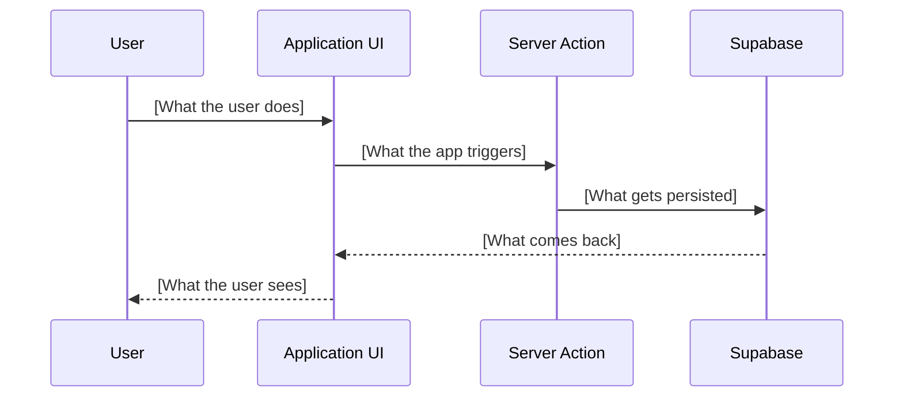
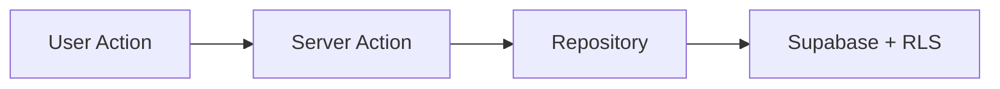

# Pull Request Skill

## When This Skill Activates

This skill automatically activates when you:
- Create a pull request
- Are asked to submit code for review
- Need to push and open a PR
- Use `/pr` command

## CRITICAL GATES (All Must Pass)

1. **Unit tests exist** for changed code (unless exempted — see below)
2. **`bun run ci` passes** with zero errors
3. **PR description is rich and detailed** (not a stub)

## Workflow

### Step 0: Ensure Unit Tests Exist (MANDATORY)

Before running CI, verify that tests exist for the code being changed:

```bash
# Check for test files near changed source files
git diff --name-only main...HEAD | grep -v __tests__ | head -20
```

**For each changed source file**, there SHOULD be a corresponding test in `__tests__/`:

```
app/(protected)/calls/actions/cancel-call.ts
  → app/(protected)/calls/actions/__tests__/cancel-call.test.ts

app/_shared/repositories/leads.repository.ts
  → app/_shared/repositories/__tests__/leads.repository.test.ts
```

**If tests are missing**: Write them before proceeding. Follow the `testing-patterns` skill.

**Exemptions** (tests not required):
- Pure UI/layout changes (`loading.tsx`, `error.tsx`, CSS-only)
- Config file changes (`next.config.mjs`, `tailwind.config.ts`)
- Documentation-only changes (`CLAUDE.md`, `*.md`)
- Type-only changes (`types.ts`, `database.types.ts`)
- Generated files (migrations, type generation output)
- Skill files (`.claude/skills/**`)

### Step 1: Run CI (MANDATORY — Hard Gate)

```bash
bun run ci
```

This runs: lint + typecheck + tests + repository pattern checks + smoke tests.

**If CI fails:**
1. Read the error output carefully
2. Fix ALL failures (lint, type errors, test failures)
3. Stage and commit the fixes
4. Re-run `bun run ci`
5. Only proceed when CI passes with **zero errors**

**Do NOT:**
- Skip CI with `--no-verify` or similar flags
- Create the PR anyway with "will fix in follow-up"
- Only run part of CI (e.g., just tests without typecheck)

### Step 2: Gather Context from Linear

Extract the Linear issue ID from the branch name (e.g., `fix/[PROJ]-XXX-csv-import-timeout` → `[PROJ]-XXX`).

**Use the Linear MCP tool** to fetch issue details:

```
Tool: mcp__linear-server__get_issue
  id: "[PROJ]-XXX"
  includeRelations: true
```

Extract from the Linear issue:
- **Title** — use for PR title context
- **Description** — understand the original problem statement
- **Acceptance criteria** — reference in test plan
- **Labels** — map to PR label (Bug, Feature, Improvement)
- **Related/blocking issues** — mention in PR description if relevant

### Step 3: Ensure Changes Are Committed

```bash
git status
```

If there are uncommitted changes, commit them following conventional commits:
- Format: `type(scope): description`
- Types: `feat`, `fix`, `perf`, `refactor`, `test`, `docs`, `chore`, `ci`
- Include: `Co-Authored-By: Claude Opus 4.6 <noreply@anthropic.com>`

### Step 4: Craft Rich PR Description

**The PR description is a first-class artifact.** It should be detailed enough that a reviewer understands the full context without reading the code first.

Use this template, adapting sections based on PR complexity:

````markdown
## Summary

<2-5 sentences explaining what this PR does and **why**. Reference the Linear issue context.>

### Problem

<What was broken or missing? Quote from the Linear issue if helpful.>

### Solution

<How does this PR solve it? Explain the approach, not just "fixed it".>

## Changes

| File | Change |
|------|--------|
| `path/to/file.ts` | Added validation for edge case X |
| `path/to/other.ts` | Refactored to use repository pattern |

## User Journey

<How does the user experience this change? Walk through the flow step by step.>



## Architecture

<Include when the PR changes data flow, adds new patterns, or modifies architecture.>



## Edge Cases Addressed

<What boundary conditions does this PR handle? List the scenarios you considered.>

- <Edge case 1 — e.g., "Empty state: no calls exist yet">
- <Edge case 2 — e.g., "Large dataset: org with 500+ leads">
- <Edge case 3 — e.g., "Error state: Nylas API timeout">
- <Not handled (follow-up): describe any known gaps>

## Testing

### Automated
- [x] Unit tests added/updated (`__tests__/*.test.ts`)
- [x] `bun run ci` passes locally

### Manual
- [ ] <Step-by-step manual verification if applicable>
- [ ] <Edge case: describe specific scenario>

## Screenshots

<Include before/after screenshots for UI changes. Omit for backend-only.>

| Before | After |
|--------|-------|
| <screenshot> | <screenshot> |

## Linear

Fixes: [PROJ]-XXXXXX

> **Issue:** <Title from Linear>
> **Labels:** <Bug/Feature/Improvement>

## Notes for Reviewers

<Any context that helps review: trade-offs made, things you considered but rejected, known limitations, follow-up work needed.>

---

🤖 Generated with [Claude Code](https://claude.com/claude-code)
````

### Section Usage Guide

| Section | When to Include |
|---------|----------------|
| Summary + Problem + Solution | **Always** |
| Changes table | 3+ files changed |
| User Journey | Any user-facing change (UI or behavior) |
| Architecture / Mermaid diagrams | New patterns, data flow changes, multi-service interactions |
| Edge Cases Addressed | Any feature or bug fix (list what you handled + what you didn't) |
| Screenshots | Any UI change |
| Notes for Reviewers | Trade-offs, known limitations, follow-ups |

### Mermaid Diagram Cheat Sheet

Use diagrams when they clarify architecture better than prose:

```markdown
<!-- Data flow -->
graph LR / graph TD

<!-- Multi-step interactions -->
sequenceDiagram

<!-- State transitions -->
stateDiagram-v2

<!-- Decision logic -->
flowchart TD
    A{Condition?} -->|Yes| B[Action]
    A -->|No| C[Other]
```

### Step 5: Push and Create PR

```bash
# Push current branch to remote
git push -u origin HEAD

# Create PR with rich description
gh pr create --title "type(scope): description" --body "$(cat <<'EOF'
<paste rich body here>
EOF
)"
```

### Step 6: Verify PR Was Created

```bash
gh pr view --web
```

## PR Title Format

Follow conventional commits — keep under 70 characters:

```
feat(scheduler): add buffer time between bookings
fix(billing): prevent duplicate subscription on portal upgrade
refactor(webhooks): extract handler registry pattern
test(calls): add unit tests for cancel flow
```

## Labels

Always apply one label: **Bug**, **Feature**, or **Improvement** (derive from Linear issue labels).

## Decision Tree

```
Ready to create PR?
│
├── Tests exist for changed code?
│   ├── YES → Continue
│   ├── EXEMPT → Continue (UI/config/docs/types/generated)
│   └── NO → Write tests first
│
├── Run `bun run ci`
│   ├── PASS → Continue
│   └── FAIL → Fix → Re-run → Loop
│
├── Fetch Linear issue context (MCP)
│   └── Extract title, description, labels, relations
│
├── All changes committed?
│   ├── YES → Continue
│   └── NO → Commit first
│
├── Craft rich PR description
│   └── Summary + Problem + Solution + Changes + Diagrams + Testing
│
└── Create PR via gh pr create
```

## Anti-Patterns

```bash
# ❌ Creating PR without CI
gh pr create  # Without running bun run ci first!

# ❌ PR with no tests for new logic
gh pr create --title "feat: add booking validation"  # Where are the tests?

# ❌ Stub PR description
--body "Fixed the thing"  # Not enough context!

# ❌ Missing Linear context
# Not fetching the issue to understand acceptance criteria

# ❌ Skipping diagrams for architectural changes
# A 3-paragraph prose explanation when a mermaid diagram would be clearer
```

## Quick Reference

| Step | Command / Action | Required? |
|------|-----------------|-----------|
| Check tests exist | Verify `__tests__/` files | **YES** (unless exempt) |
| Run CI | `bun run ci` | **YES — MANDATORY** |
| Fetch Linear | `mcp__linear-server__get_issue` | Yes (if issue ID available) |
| Check status | `git status` | Yes |
| Commit | `git commit` (conventional) | If needed |
| Write description | Rich markdown + diagrams | **YES** |
| Create PR | `gh pr create` | Yes |
| Verify | `gh pr view` | Yes |
