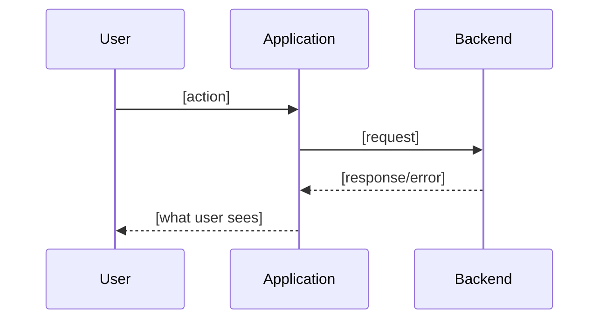
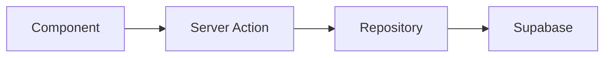

# Backlog Triage Skill

## What This Does

Scans recent Linear tickets (last 48–72 hours), identifies ones with thin or missing documentation, and enriches them with real data from production systems — making every ticket implementation-ready for any engineer to pick up.

## When This Skill Activates

- User runs `/triage`
- User asks to "review the backlog", "enrich tickets", or "triage recent issues"

## Triage Pipeline

```
Linear (recent tickets)
    │
    ├── Score documentation quality
    │   └── Flag tickets below threshold
    │
    ├── For each thin ticket:
    │   │
    │   ├── Sentry ── related errors, stack traces, frequency
    │   ├── Supabase ── affected users/orgs, data patterns
    │   ├── Codebase ── relevant files, architecture, patterns
    │   │
    │   └── Generate enrichment comment
    │       └── User story, journey, architecture, edge cases, acceptance criteria
    │
    └── Post enrichment as Linear comment (preserves original description)
```

## Step-by-Step Workflow

### Step 1: Fetch Recent Tickets

Fetch issues created in the last 72 hours that are in Backlog, Todo, or Triage states:

```
Tool: mcp__linear-server__list_issues
  team: "[YOUR_TEAM]"
  state: "backlog"   (then repeat for "triage", "todo")
  limit: 50
```

Filter to issues created within the last 72 hours by checking `createdAt`.

### Step 2: Score Documentation Quality

For each ticket, score its description against the Linear ticket skill template. A ticket is **thin** if it's missing 3+ of these:

| Section | Check | Points |
|---------|-------|:---:|
| User Story | Contains "As a" or clear persona reference | 1 |
| Current Behavior | Describes what happens today | 1 |
| Expected Behavior | Describes desired outcome | 1 |
| Edge Cases | Lists boundary conditions | 1 |
| Acceptance Criteria | Has testable criteria (checkboxes or bullet list) | 1 |
| Architecture | Mentions files, components, or data flow | 1 |
| User Journey | Has a flow or sequence description | 1 |

**Score thresholds:**
- 5-7: Well documented — skip
- 3-4: Partially documented — enrich missing sections only
- 0-2: Thin — full enrichment needed

Report the scoring summary to the user before enriching:

```
Triage Summary (last 72 hours)
──────────────────────────────────────────
  [PROJ]-XXX  "Fix dashboard timeout"           Score: 1/7  THIN
  [PROJ]-XXX  "Add CSV export to calls"         Score: 2/7  THIN
  [PROJ]-XXX  "Handbook migration"              Score: 6/7  OK
  [PROJ]-XXX  "Update billing copy"             Score: 4/7  PARTIAL
──────────────────────────────────────────
  4 tickets scanned | 2 need enrichment | 1 partial
```

**Ask the user** which tickets to enrich before proceeding (they may want to skip some).

### Step 3: Gather Context from Production Systems

For each ticket to enrich, pull data from three sources in parallel:

#### 3a: Sentry — Error Context

Search for related errors using keywords from the ticket title:

```
Tool: mcp__sentry__search_issues
  query: "<keywords from ticket title>"
  project: "[YOUR_SENTRY_PROJECT]"
```

If matches found, get details:

```
Tool: mcp__sentry__get_issue_details
  issue_id: "<sentry issue id>"
```

Extract:
- Error message and stack trace
- Frequency (events/day)
- Affected users count
- First/last seen dates
- Browser/OS distribution (if relevant)

#### 3b: Supabase — Data Context

Query for relevant data patterns. Adapt queries based on the ticket topic:

**For user-facing bugs:**
```sql
-- How many users/orgs are potentially affected?
SELECT COUNT(DISTINCT organization_id) as affected_orgs,
       COUNT(DISTINCT user_id) as affected_users
FROM <relevant_table>
WHERE <condition matching the bug>;
```

**For feature requests:**
```sql
-- Current usage patterns to inform design
SELECT COUNT(*) as total,
       <relevant_grouping>
FROM <relevant_table>
GROUP BY <grouping>
ORDER BY total DESC
LIMIT 10;
```

**For performance issues:**
```sql
-- Data volume that the feature needs to handle
SELECT COUNT(*) as row_count,
       pg_size_pretty(pg_total_relation_size('<table>')) as table_size
FROM <relevant_table>;
```

Use `mcp__plugin_supabase_supabase__list_tables` to discover relevant tables if needed.

#### 3c: Codebase — Architecture Context

Search for relevant code:

```bash
# Find files related to the ticket's domain
Grep: pattern matching ticket keywords
Glob: find relevant component/action/repository files
Read: understand the current implementation
```

Extract:
- Key files involved (with paths)
- Current architecture (data flow)
- Existing patterns to follow
- Related tests that exist

### Step 4: Generate Enrichment

Compose the enrichment following the Linear ticket skill template. Structure it as a comment:

````markdown
## Triage Enrichment

> Auto-generated by `/triage` on YYYY-MM-DD. Data pulled from Sentry, Supabase, and codebase analysis.

### User Story

As a **[persona derived from context]**, I want to **[action from ticket title]** so that **[outcome inferred from context]**.

### Impact Assessment

| Metric | Value |
|--------|-------|
| Affected orgs | X (from Supabase) |
| Affected users | Y (from Supabase) |
| Error frequency | Z events/day (from Sentry) |
| First seen | YYYY-MM-DD (from Sentry) |

### Current Behavior

<Describe based on codebase reading and Sentry data>

### Expected Behavior

<Describe based on ticket title/description and domain understanding>

### User Journey



### Architecture



**Key files:**
| File | Role |
|------|------|
| `path/to/file.ts` | Current implementation |

### Sentry Context

<Error details, stack trace summary, frequency>

### Edge Cases

- [ ] <Edge case derived from data patterns>
- [ ] <Edge case from error variants in Sentry>
- [ ] <Edge case from data volume/distribution>

### Acceptance Criteria

- [ ] <Criterion 1>
- [ ] <Criterion 2>
- [ ] <Criterion 3>
- [ ] Unit tests cover core logic
- [ ] `bun run ci` passes

### Suggested Testing

- Unit: <specific functions to test>
- Manual: <specific scenarios to verify>

### Suggested Priority

<Based on: affected users, error frequency, severity>
````

### Step 5: Route the Enrichment

The enrichment output goes to different places depending on the ticket's origin and quality. Detect the context and choose the right strategy:

#### Decision Matrix

```
Ticket context?
│
├── Score 0-2 (thin description)?
│   └── STRATEGY A: Append to description
│       (Keep original as "Original Report" section, append enrichment below)
│
├── Score 3-4 (partial, human-authored)?
│   └── STRATEGY B: Add Linear comment
│       (Description has real context — enrich alongside, not inline)
│
└── Has Slack thread attachment?
    └── STRATEGY C: Use A or B (based on score) + reference Slack thread
        (Linear's Slack sync surfaces the update in the thread)
```

**NEVER overwrite the original description.** The original report — however brief — is the author's signal. Always preserve it.

#### Detecting Slack Origin

Use `mcp__linear-server__get_issue` with `includeRelations: true`. Check for:
- Attachments with a Slack URL (`slack.com` or `*.slack.com`)
- Source metadata indicating Slack integration

If a Slack attachment exists, note it in the enrichment header so the team knows the conversation context:

```markdown
> Triage enrichment for ticket created from [Slack thread](<slack-url>).
> See the original thread for discussion context.
```

#### Strategy A: Append to Description (score 0-2, thin content)

When the description is thin, **keep the original as-is** and append the enrichment below it. Never overwrite — the original report is the author's signal, however brief:

```
Tool: mcp__linear-server__update_issue
  id: "[PROJ]-XXXXXX"
  description: <original description + appended enrichment>
  labels: ["Bug"] or ["Feature"] or ["Improvement"]
  priority: <suggested priority>
```

The updated description should look like:

```markdown
## Original Report

<the original description exactly as written>

---

## Triage Enrichment

> Auto-generated by `/triage` on YYYY-MM-DD. Data pulled from Sentry, Supabase, and codebase analysis.

<full enrichment content: user story, impact, journey, architecture, edge cases, acceptance criteria>
```

#### Strategy B: Add Comment (score 3-4, human-authored)

When there's meaningful human context worth preserving, post enrichment as a comment:

```
Tool: mcp__linear-server__create_comment
  issueId: "[PROJ]-XXXXXX"
  body: <enrichment markdown>
```

Also update metadata if missing:
```
Tool: mcp__linear-server__update_issue
  id: "[PROJ]-XXXXXX"
  labels: ["Bug"] or ["Feature"] or ["Improvement"]  (if no label set)
  priority: <suggested priority>                       (if no priority set)
```

#### Strategy C: Slack-Origin Ticket

Same as Strategy A or B (based on description quality), but with two additions:

1. **Header references the Slack thread** — helps engineers find the discussion
2. **Keep the enrichment concise** — Slack thread previews truncate long content, so lead with the Impact Assessment and Acceptance Criteria (the most actionable sections)

#### Reporting the Strategy

In the scoring summary (Step 2), show which strategy will be used:

```
Triage Summary (last 72 hours)
──────────────────────────────────────────────
  [PROJ]-XXX  Score: 1/7  THIN       → Update description
  [PROJ]-XXX  Score: 2/7  THIN       → Update description (Slack origin)
  [PROJ]-XXX  Score: 4/7  PARTIAL    → Add comment
──────────────────────────────────────────────
```

### Step 6: Report Results

After processing all tickets, give the user a summary:

```
Triage Complete
──────────────────────────────────────────
  [PROJ]-XXX  Enriched  (3 Sentry errors, 47 affected users)
  [PROJ]-XXX  Enriched  (no Sentry hits, 12 orgs use this feature)
  [PROJ]-XXX  Partially enriched (added edge cases + architecture)
──────────────────────────────────────────
  3 tickets enriched | Ready for pickup
```

## Important Rules

### DO
- **Never overwrite** the original description — always preserve it (as "Original Report" section or untouched)
- Route output based on context: append to description (thin), add comment (human-authored), reference Slack thread (Slack-origin)
- Show the scoring summary and **ask before enriching** — the user may want to skip tickets
- Include data sources in the enrichment ("from Sentry", "from Supabase query")
- Reference specific file paths, not vague component names
- Use mermaid diagrams for user journeys and architecture
- Suggest priority based on data (affected users, error frequency)

### DON'T
- Don't overwrite or remove the original description — ever
- Don't enrich tickets that already score 5+ (they're fine)
- Don't fabricate data — if Sentry/Supabase returns nothing, say "No data found"
- Don't change ticket assignees or states without asking
- Don't over-query Supabase — keep queries targeted and read-only (SELECT only)
- Don't expose PII (emails, names) in enrichment comments — use counts and aggregates
- Don't skip the user confirmation step — always show the summary first

## Customization

The user can customize the triage run:

```
/triage                     # Default: last 72 hours, all states
/triage 24h                 # Last 24 hours only
/triage [PROJ]-XXX [PROJ]-XXX     # Specific tickets only
/triage bugs                # Only tickets labeled "Bug"
```

Parse these arguments at the start of the workflow and adjust the Linear query accordingly.

## Data Privacy

- All Supabase queries MUST use aggregates (COUNT, AVG, etc.) — never SELECT individual user data
- Never include email addresses, names, or other PII in enrichment comments
- Sentry data should summarize error patterns, not expose individual user sessions
- If uncertain whether data is sensitive, err on the side of excluding it
